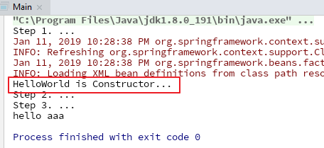

# java-example-spring

```
视频地址：
https://www.bilibili.com/video/av21335209
```

## 一、Spring简介

### 1. Spring基础知识


### 2. 基于Spring的Hello World

#### 2.1 创建一个Maven工程，并添加maven依赖

```xml
<project xmlns="http://maven.apache.org/POM/4.0.0" xmlns:xsi="http://www.w3.org/2001/XMLSchema-instance"
  xsi:schemaLocation="http://maven.apache.org/POM/4.0.0 http://maven.apache.org/xsd/maven-4.0.0.xsd">
  <modelVersion>4.0.0</modelVersion>

  <groupId>com.example</groupId>
  <artifactId>spring</artifactId>
  <version>1.0-SNAPSHOT</version>
  <packaging>jar</packaging>

  <name>spring</name>
  <url>http://maven.apache.org</url>

  <properties>
    <project.build.sourceEncoding>UTF-8</project.build.sourceEncoding>
  </properties>

  <dependencyManagement>
    <dependencies>
      <dependency>
        <groupId>io.spring.platform</groupId>
        <artifactId>platform-bom</artifactId>
        <version>Brussels-SR15</version>
        <type>pom</type>
        <scope>import</scope>
      </dependency>
    </dependencies>
  </dependencyManagement>

  <dependencies>
    <dependency>
      <groupId>org.springframework</groupId>
      <artifactId>spring-core</artifactId>
    </dependency>

    <dependency>
      <groupId>org.springframework</groupId>
      <artifactId>spring-context</artifactId>
    </dependency>

    <dependency>
      <groupId>org.springframework</groupId>
      <artifactId>spring-beans</artifactId>
    </dependency>

    <dependency>
      <groupId>org.springframework</groupId>
      <artifactId>spring-expression</artifactId>
    </dependency>

    <dependency>
      <groupId>commons-logging</groupId>
      <artifactId>commons-logging</artifactId>
      <version>1.2</version>
    </dependency>
  </dependencies>
</project>

```

#### 2.2 创建一个HelloWorld类

``` java
package com.example.bean;

public class HelloWorld {

    private String name;

    public String getName() {
        return name;
    }

    public void setName(String name) {
        this.name = name;
    }

    public HelloWorld() {
        System.out.println("HelloWorld is Constructor...");
    }

    public HelloWorld(String name) {
        this.name = name;
    }

    public void hello() {
        System.out.println("hello " + this.name);
    }

}

```

#### 2.3 创建resources/applicationContext.xml文件

``` xml
<?xml version="1.0" encoding="UTF-8"?>
<beans xmlns="http://www.springframework.org/schema/beans"
    xmlns:xsi="http://www.w3.org/2001/XMLSchema-instance"
    xsi:schemaLocation="http://www.springframework.org/schema/beans
        http://www.springframework.org/schema/beans/spring-beans.xsd">

    <!--配置bean-->
    <bean id="helloWorld" class="com.example.bean.HelloWorld">
        <property name="name" value="aaa" />
    </bean>

</beans>
```

#### 2.4 创建一个Main方法来创建容器对象，并调用hello方法

``` java
package com.example.bean;

import org.springframework.context.ApplicationContext;
import org.springframework.context.support.ClassPathXmlApplicationContext;

public class Main {

    public static void main(String[] args) {

        // 1. 创建spring的ioc容器对象
        System.out.println("Step 1. ...");
        ApplicationContext context = new ClassPathXmlApplicationContext("classpath:applicationContext.xml");
        
        // 2. 从ioc容器对象中回去bean实例
        System.out.println("Step 2. ...");
        HelloWorld helloWorld = (HelloWorld) context.getBean("helloWorld");

        // 3. 调用hello方法
        System.out.println("Step 3. ...");
        helloWorld.hello();

    }

}

```

#### 2.4 运行结果

可以看到创建容器对象，就创建了HelloWorld对象



### 3. IOC和DI

**IOC：** Inversion of Control， 控制反转

**DI：** Dependency Injection， 依赖注入 。

### 4. IOC的前世今生

#### 4.1 分离接口与实现

#### 4.2 工厂设计模式

#### 4.3 IOC 控制反转

## 二、 Spring中Bean的配置

### 1. 通过config文件来配置Bean

**名词解释**

* **class：** bean的全类名，通过反射的方法在IOC容器中创建Bean，因此Bean里面一定要有一个无参的构造器

* **id：** 标识容器的bean，id唯一

* ioc容器的实现：

  * BeanFactory是ioc容器的基本实现

  * ApplicationContext是BeanFactory的子接口，提供了更多的高级特性

    **几乎所有的应用场合都使用ApplicationContext，而不是BeanFactory**

* ApplicationContext的主要实现类：

  * **ClassPathXmlApplicationContext**：从类路径下加载配置文件
  * **FileSystemXmlApplicationContext**：从文件系统中加载配置文件

### 2. 依赖注入的方式

#### 2.1 属性注入

**概念：** 通过setter方法像属性赋值 （最常用的方式）

```xml
<bean id="helloWorld" class="com.example.bean.HelloWorld">
    <property name="name" value="aaa" />
</bean>
```

#### 2.2 构造器注入

**概念：** 通过constructor-arg来配置属性

```xml
<bean id="helloWorld" class="com.example.bean.HelloWorld">
    <constructor-arg value="qqq" index="0" type="java.lang.String"/>
</bean>
```

灵活使用index和type，以区分重载构造器

#### 2.3 工厂方法注入

很少用，不推荐。